# Together – Youth Club Management System

<p align="center">
  
</p>

<p align="center">
  <b>Organize. Engage. Grow.</b><br/>
  Youth club operations in one Android app – built with Kotlin.
</p>

---

## 🧩 Overview

**Together** is a native Android application designed to streamline youth club operations.  
It consolidates **members**, **tasks**, **projects**, and **budget** management into a single, intuitive mobile experience.

This version focuses on:

- A smooth **launch + onboarding** experience  
- A clear **login + two-step registration** funnel  
- A **home dashboard** that acts as the command center  
- Dedicated screens for **Members**, **Tasks**, **Projects**, **Budget**, and **Profile**  
- An **offline-first** implementation (no backend yet), ideal for demos, viva, and academic evaluation

---

## ✨ Main Features

| Area                          | Description |
|-------------------------------|-------------|
| **Launch & Onboarding**      | Branded splash screen and a 3-step onboarding journey explaining the app’s value and capabilities. Onboarding is shown only once using `SharedPreferences`. |
| **Authentication (2-Step)**  | Modern login screen plus a structured two-step registration flow: personal details → secure account setup with password strength checks. |
| **Home Dashboard**           | Time-based greeting, quick stats, quick actions, recent activities, and upcoming events – a “single pane of glass” for the club. |
| **Members & Attendance**     | Member stats, search, and “Mark All Present” interactions with a layout ready for real attendance tracking. |
| **Tasks Management**         | Create tasks, assign them to leadership roles, set due dates, and mark tasks as complete. |
| **Project Planning**         | Define projects/events with name, date, time, and location; view upcoming projects in a concise list. |
| **Budget Tracking**          | Record income and expenses, maintain running totals, and see the current balance at a glance. |
| **Profile & Settings**       | Profile header plus entry points for account, privacy, help, and logout (wired as placeholders for future logic). |

---

## 🧭 User Journey & Screen Flow

### 1. Launch & Onboarding

**Files**

- `LaunchActivity.kt`, `activity_launch.xml`  
- `Onboarding1Activity.kt`, `Onboarding2Activity.kt`, `Onboarding3Activity.kt`  
- `activity_onboarding1.xml`, `activity_onboarding2.xml`, `activity_onboarding3.xml`

**Behaviour**

- **LaunchActivity**
  - Shows app logo, name, and tagline.
  - After a short delay, navigates into the onboarding sequence (or can later skip if `onboarding_done` is set).

- **Onboarding 1–3**
  - Introduce Together and what it can do:
    - Manage Members
    - Plan Projects
    - Manage Tasks
    - Track Budget
  - Final screen sets `onboarding_done = true` in `SharedPreferences` and routes to `LoginActivity`.

---

### 2. Authentication – Login & Registration

**Files**

- `LoginActivity.kt`, `activity_login.xml`  
- `Register1Activity.kt`, `activity_register1.xml`  
- `Register2Activity.kt`, `activity_register2.xml`  

#### Login

- Fields:
  - Email Address  
  - Password  
- Actions:
  - **Sign In** → navigates to `HomeActivity` (no server validation yet).  
  - **Sign Up here** → goes to registration step 1.  
- Social buttons are visually present for future integrations.

#### Registration – Step 1 (Personal Details)

Collects core member profile details:

- Full Name  
- Age  
- Phone Number  
- Leadership Position (`Spinner` backed by `arrays.xml`, e.g., President, Vice President, Secretary)

Validation:

- Non-empty name  
- Age within a sensible range (10–100)  
- Phone length 9–15 characters  
- Leadership position must not be the placeholder value  

On success, data is passed to `Register2Activity` via `Intent` extras.

#### Registration – Step 2 (Security & Account)

- Fields:
  - Email  
  - Password  
  - Confirm Password  
  - Terms & Conditions checkbox  

- **Live Password Strength UI**
  - Watches password input in real time.
  - Checks:
    - Minimum length
    - Uppercase character
    - Lowercase character
    - Digit
    - Special character
  - Shows a strength label (“Very Weak” → “Strong”) and per-condition indicators (✓/✗ with colour).

- Final validation:
  - Email pattern must be valid.
  - Password must satisfy all rules.
  - Confirm password must match.
  - Terms checkbox must be selected.

On success, navigates to `HomeActivity`.

> Current implementation is **frontend-only** – credentials are not yet sent to any server or stored in a remote database.

---

### 3. Home Dashboard

**Files**

- `HomeActivity.kt`, `activity_home.xml`

**Key elements**

- **Dynamic greeting** based on time: “Good Morning / Good Afternoon / Good Evening”.
- Shows optional `display_name` passed via Intent (e.g., after registration).
- Top bar:
  - Profile avatar → opens `ProfileActivity`.
  - Notification icon → toast placeholder for future notifications center.

- **Quick stats** (static sample numbers):
  - Active Members
  - Active Projects
  - Pending Tasks

- **Quick Actions** (cards):
  - Manage Members → `ManageMembersActivity`
  - Plan Projects → `PlanProjectsActivity`
  - Manage Tasks → `ManageTaskActivity`
  - Track Budget → `TrackBudgetActivity`

- **Recent Activity**:
  - Sample updates like new member added, project deadlines, budget updates.

- **Upcoming Events**:
  - Horizontal list of upcoming youth club events.

---

### 4. Members & Attendance

**Files**

- `ManageMembersActivity.kt`, `activity_manage_members.xml`

**Highlights**

- Summary strip:
  - Total Members  
  - Present Today  
  - Attendance Rate  
- Search bar:
  - IME “search” hides keyboard and shows a toast.
  - Tapping outside the input also hides the keyboard for a neat UX.
- “Today’s Attendance” row:
  - “Mark All Present” button → toast placeholder for mass-mark logic.
- Sample member cards:
  - Showcase names, leadership positions, and present/absent badges.

This screen is ready to be upgraded with a **RecyclerView + Room/Firebase** for real data.

---

### 5. Task Management

**Files**

- `ManageTaskActivity.kt`, `activity_manage_task.xml`

**Capabilities**

- **Add New Task** block:
  - Task name  
  - Assign to (Spinner using `leadership_positions`)  
  - Due date (`DatePickerDialog`)  

- Validation:
  - Task name and due date required.

- On “Add Task”:
  - Shows a confirmation toast.  
  - Clears input fields and resets the spinner.

- **Current Tasks** section:
  - Example task card (“Buy refreshments”) with assigned member, due date, and PENDING badge.
  - Checkbox triggers a toast when marked complete.

---

### 6. Project & Event Planning

**Files**

- `PlanProjectsActivity.kt`, `activity_plan_projects.xml`

**Behaviour**

- Shows predefined upcoming projects/events as example cards.
- “Create a new project” form:
  - Project name
  - Date (`DatePickerDialog`)
  - Time (`TimePickerDialog`)
  - Location
- Validation ensures all fields are filled.
- On successful submission:
  - Toast confirms creation.
  - Calls `finish()` to return to the previous screen.

---

### 7. Budget Tracking

**Files**

- `TrackBudgetActivity.kt`, `activity_track_budget.xml`

**Budget model**

- Summary header showing:
  - Total Balance = Total Income – Total Expenses
  - Total Income
  - Total Expenses  
  (Seed values used so the UI looks realistic on first run.)

- Add entry form:
  - Type (Income / Expenses – from spinner)
  - Amount
  - Title
  - Date (`DatePickerDialog`)

**Logic**

- Validates:
  - Amount is numeric.
  - Title and date are not empty.
- Updates totals depending on type.
- Recomputes and displays the new balance.
- Resets form after each entry and shows a toast.

---

### 8. Profile & Settings

**Files**

- `ProfileActivity.kt`, `activity_profile.xml`

**Structure**

- Profile header:
  - Avatar, name, email.
- Personal info:
  - Age, phone, leadership position (static sample data).
- Settings tiles:
  - Account Settings  
  - Privacy & Security  
  - Help & Support  
  - Logout  

All tiles currently show toasts; **Logout** is the natural integration point for session clearing and navigation back to `LoginActivity`.

---

## 🎨 Design System & Theming

Design tokens and styles are defined in:

- `colors.xml`
- `styles.xml`
- `strings.xml`
- `arrays.xml`

### Color Palette (60–30–10)

Example usage pattern:

| Usage             | Color Name       | Hex        |
|-------------------|------------------|------------|
| Primary (≈60%)    | `primary_blue`   | `#4A90E2`  |
| Secondary (≈30%)  | `secondary_green`| `#7ED321`  |
| Accent (≈10%)     | `accent_purple`  | `#7B68EE`  |

> Additional colours support background surfaces, borders, neutral text and status states (success, error, warning, pending).

### Typography & Components

- Heading, body, and caption text styles centralised in `styles.xml`.
- Reusable button styles for primary and secondary CTAs.
- Card styles with consistent radius, elevation, and padding across all modules.

### Themes

- `AppTheme` – main app screens.  
- `SplashTheme` – launch screen styling.  
- `OnboardingTheme` – full-screen onboarding look with transparent status bar.  
- `AuthTheme` – clean, focused visuals for login and registration.

---

## 🖼️ App UI Screenshots

> All screenshots live under the `screenshots/` folder in the repository.

### Launch & Onboarding

<table>
  <tr>
    <th>Launch</th>
    <th>Onboarding 1</th>
    <th>Onboarding 2</th>
    <th>Onboarding 3</th>
  </tr>
  <tr>
    <td>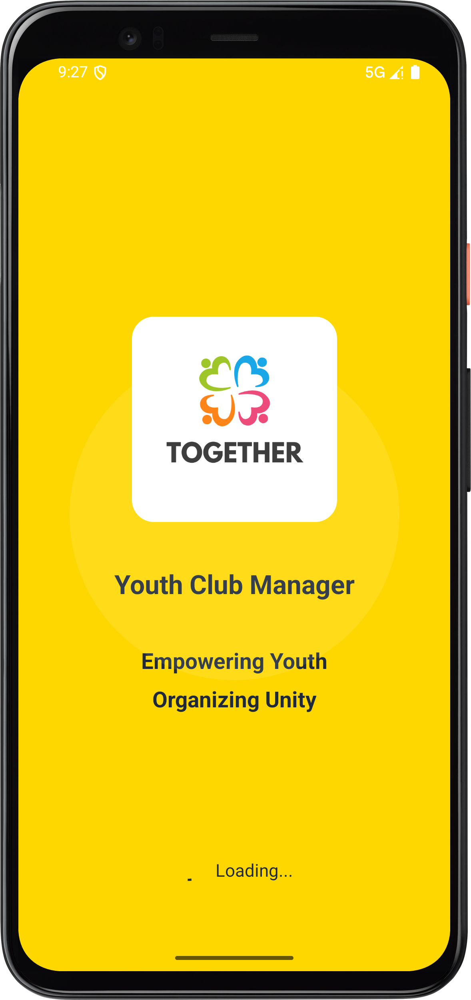</td>
    <td>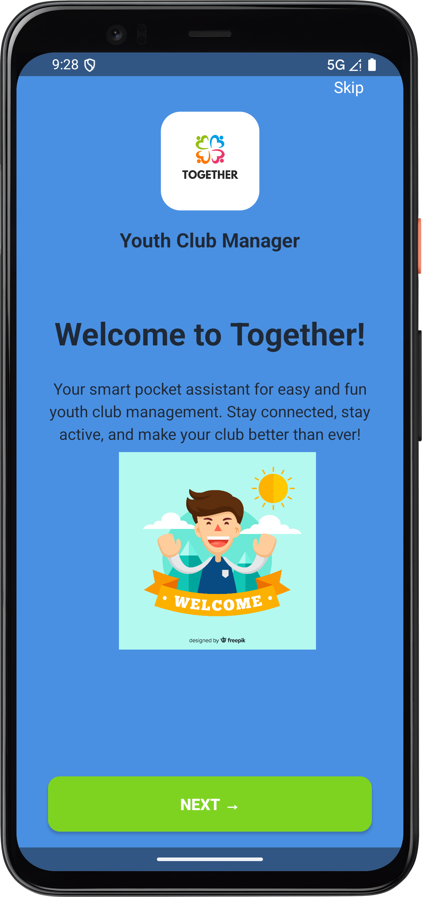</td>
    <td>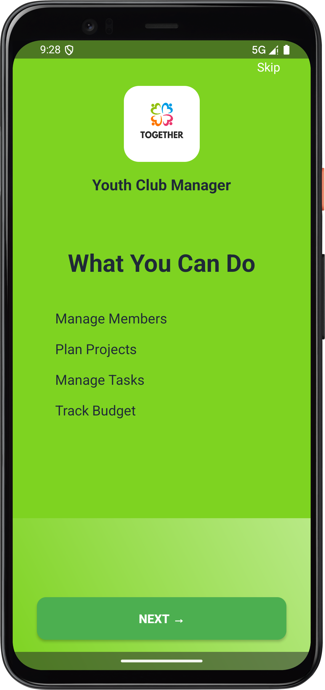</td>
    <td>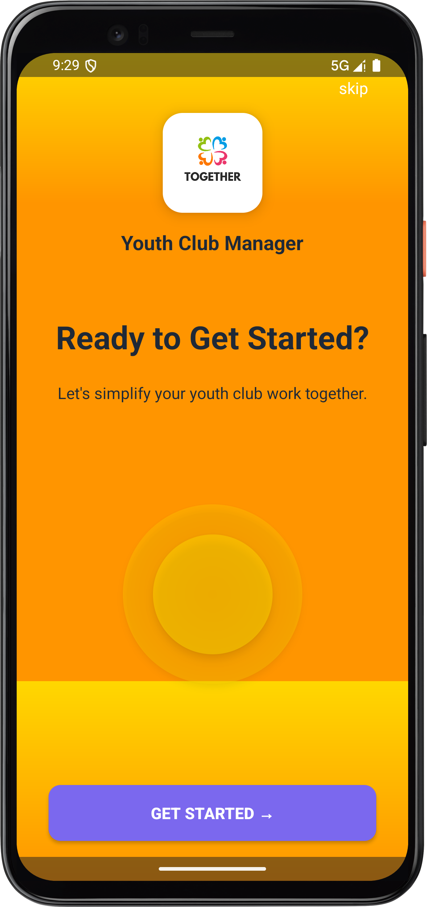</td>
  </tr>
</table>

### Authentication

<table>
  <tr>
    <th>Login</th>
    <th>Registration – Step 1</th>
    <th>Registration – Step 2</th>
  </tr>
  <tr>
    <td>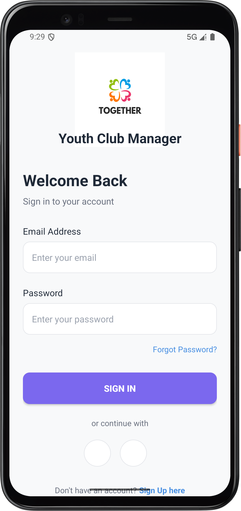</td>
    <td>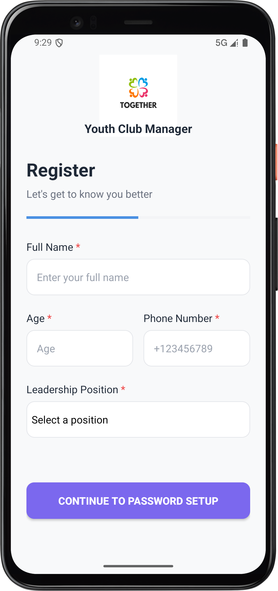</td>
    <td>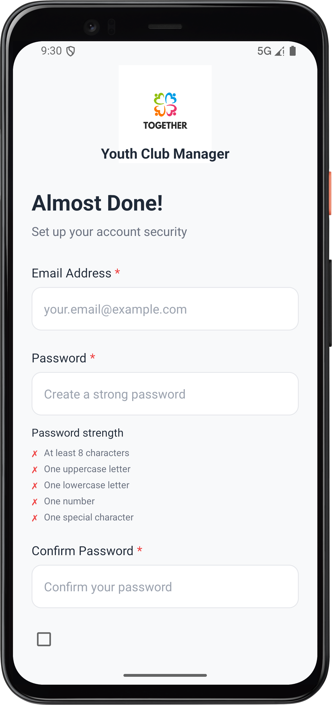</td>
  </tr>
</table>

### Core Modules & Dashboard

<table>
  <tr>
    <th>Home Dashboard</th>
    <th>Manage Members</th>
    <th>Manage Tasks</th>
  </tr>
  <tr>
    <td>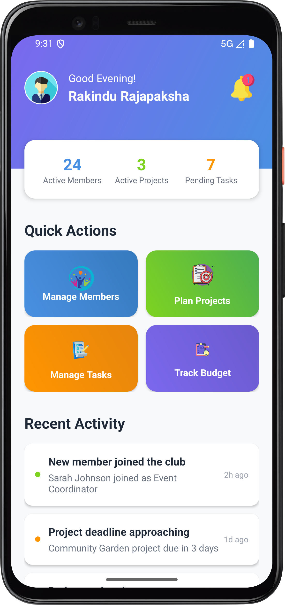</td>
    <td>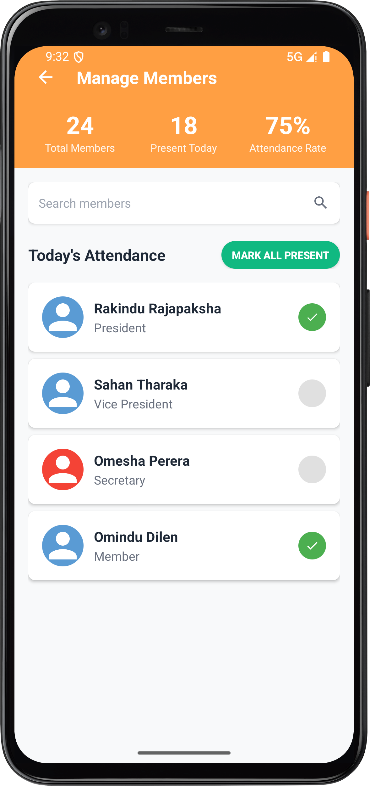</td>
    <td>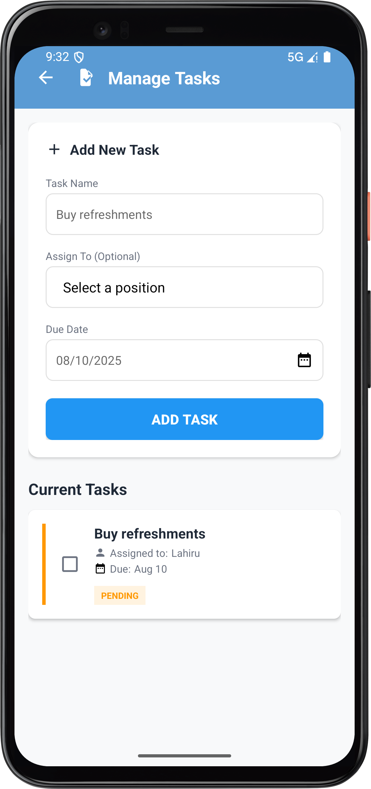</td>
  </tr>
</table>

<table>
  <tr>
    <th>Plan Projects</th>
    <th>Track Budget</th>
    <th>Profile</th>
  </tr>
  <tr>
    <td>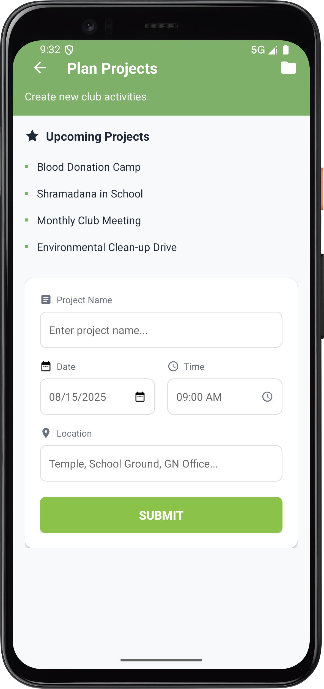</td>
    <td>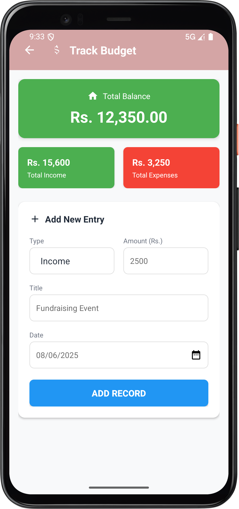</td>
    <td>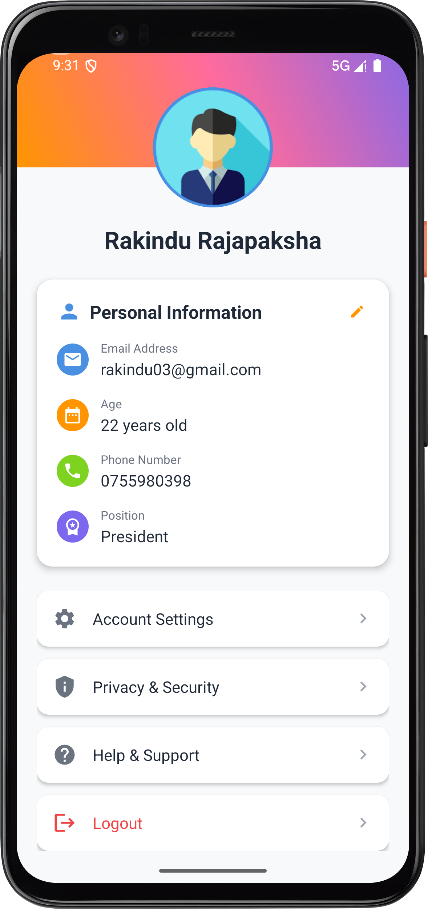</td>
  </tr>
</table>

---

## 🛠 Tech Stack

| Layer      | Technology / Approach                              |
|-----------|-----------------------------------------------------|
| Language  | Kotlin                                              |
| UI        | XML layouts, ConstraintLayout, CardView             |
| Navigation| Activity-based (multiple Activities, no Fragments)  |
| State     | In-memory state + `SharedPreferences` (onboarding)  |
| Dialogs   | `DatePickerDialog`, `TimePickerDialog`              |
| IDE       | Android Studio                                      |

> Backend is **not** implemented yet. The app is deliberately kept frontend-only so a REST API, Firebase, or Room database can be plugged in later without redesigning flows.

---

## ⚙️ Installation

1. **Clone the repository**
   ```bash
   git clone https://github.com/rakimnr/Together.git
   cd Together
